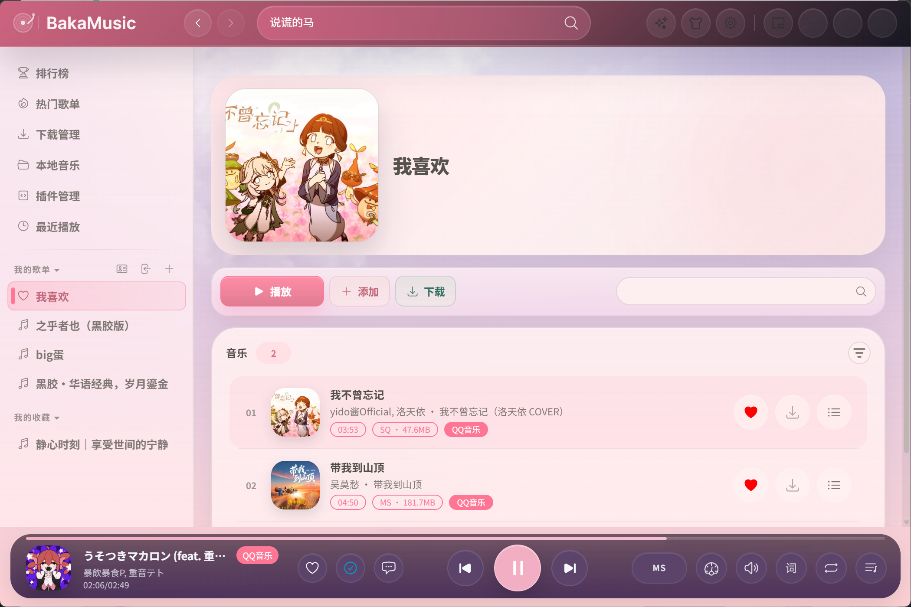
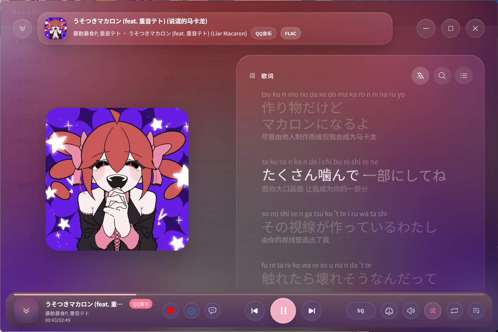
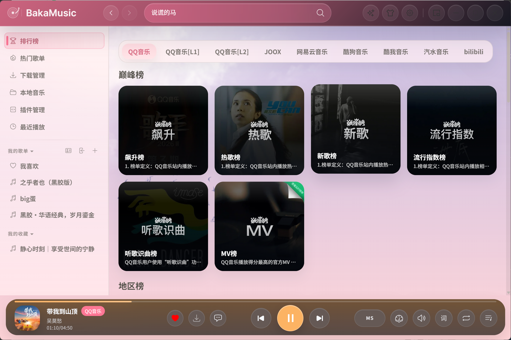
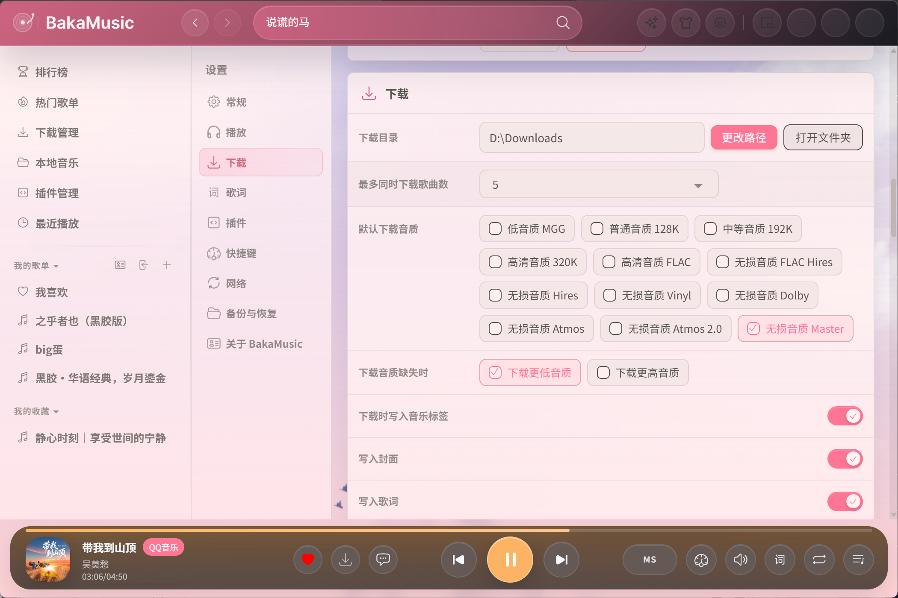
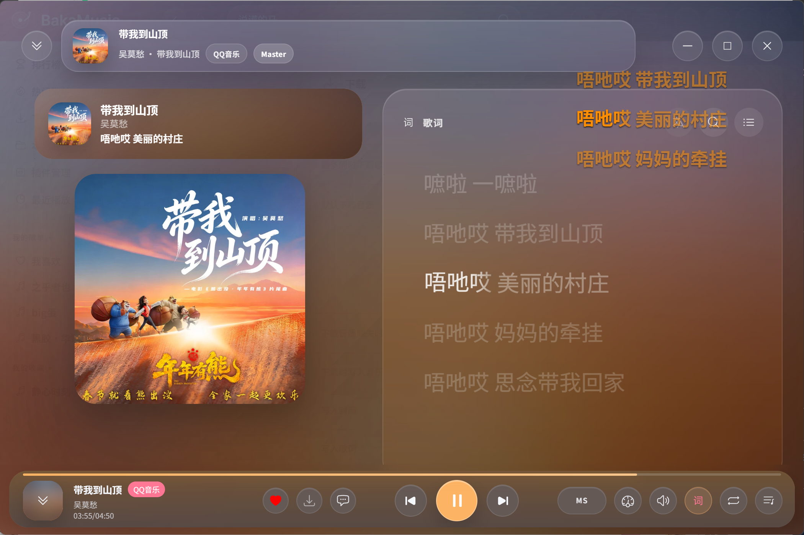

# BakaMusic

[](https://github.com/Zencok/BakaMusic/stargazers)
[](https://github.com/Zencok/BakaMusic/forks)
[](https://github.com/Zencok/BakaMusic/releases/latest)
[](https://github.com/Zencok/BakaMusic/releases)
[](https://github.com/Zencok/BakaMusic/issues)
[](LICENSE)

---

**无广告。无内置音源。完全由你掌控。**

BakaMusic 是一款基于插件的跨平台桌面音乐播放器，构建于 Electron 40 + React 18 + TypeScript 之上，支持 Windows、macOS 和 Linux。应用本身不绑定任何平台——通过插件，互联网上的任意音源均可接入。

## 特性

| | 功能 | 说明 |
|---|---|---|
| 🔌 | **插件化音源** | 不内置任何平台，通过插件扩展搜索、播放、歌词、歌单导入等能力 |
| 🎤 | **逐字歌词** | 支持 word-level 逐字歌词、翻译歌词与罗马音注音 |
| 🖥️ | **桌面歌词** | 独立悬浮歌词窗口，支持自定义字体与样式 |
| 📦 | **迷你模式** | 紧凑型播放器，不占桌面空间 |
| 🎨 | **主题包系统** | CSS 变量 + iframe 背景，外观高度可定制 |
| 🎵 | **多音质支持** | 128k / 320k / FLAC / Hi-Res / Dolby Atmos 等 |
| ⬇️ | **下载管理** | 并发下载队列，支持音质选择与进度追踪 |
| 📁 | **本地音乐** | 扫描本地目录，自动识别元信息，支持多种视图 |
| 🌐 | **多语言** | 简体中文、繁体中文、英文 |
| 🔒 | **隐私优先** | 所有数据存储在本地，不上传个人信息 |

## 下载

前往 [GitHub Releases](https://github.com/Zencok/BakaMusic/releases) 下载对应平台安装包：

| 平台 | 格式 |
|------|------|
| Windows x64 | Setup 安装包 / Portable 免安装 |
| Windows x64 Legacy | 兼容旧系统 (Electron 22) |
| macOS x64 | DMG |
| macOS arm64 (Apple Silicon) | DMG |
| Linux amd64 | DEB |

## 快速开始

```bash
# 安装依赖
npm install

# 启动开发模式
npm start

# 带 Electron Inspector 启动
npm run dev

# 代码检查
npm run lint

# 打包（不含安装器）
npm run package

# 构建平台安装包
npm run make
```

### 构建 Windows 安装包

需要安装 [Inno Setup](https://jrsoftware.org/isinfo.php) 并将 `iscc` 加入 PATH：

```bash
npm run package
MSYS_NO_PATHCONV=1 iscc /DMyAppVersion=1.0.0 /DMyAppId=BakaMusic "release/build-windows.iss"
```

## 插件

插件协议与 [MusicFree 安卓版](https://github.com/maotoumao/MusicFree) 完全兼容，可实现搜索、播放、歌词获取、专辑/作者详情、歌单导入等。

开发文档：[插件开发指南](https://musicfree.catcat.work/plugin/introduction.html)

## 截图

**主页** — 聚合推荐、最近播放与快速入口



**播放详细页** — 流体云歌词面板，沉浸式封面背景



**推荐歌单 / 榜单** — 来自插件的聚合内容，支持一键导入




**主题市场** — 在线浏览、预览并安装社区主题包


**设置** — 音源、音质、外观、快捷键等全局配置



**多窗口联动** — 播放详细页、桌面歌词悬浮窗与迷你模式同时使用



## 主题包

主题包是包含 `index.css` 和 `config.json` 的文件夹。通过覆盖 CSS 变量自定义外观：

```css
:root {
  --primaryColor: #f17d34;
  --backgroundColor: #fdfdfd;
  --textColor: #333333;
  --dividerColor: rgba(0, 0, 0, 0.1);
  --listHoverColor: rgba(0, 0, 0, 0.05);
  --listActiveColor: rgba(0, 0, 0, 0.1);
  --maskColor: rgba(51, 51, 51, 0.2);
  --shadowColor: rgba(0, 0, 0, 0.2);
  --successColor: #08A34C;
  --dangerColor: #FC5F5F;
  --infoColor: #0A95C8;
}
```

`config.json` 支持通过 `iframes` 字段将 HTML 页面作为软件背景。

| 主题 | 预览 |
|------|------|
| 暗黑模式 |  |

## 架构

```
src/
├── main/                 # Electron 主进程（窗口管理、托盘、深度链接）
├── renderer/             # 主窗口（React）
│   ├── components/       # 可复用 UI 组件
│   ├── pages/            # 页面视图
│   ├── core/             # 核心业务（播放器、下载器、歌单、本地音乐）
│   └── utils/            # 工具函数
├── renderer-lrc/         # 桌面歌词窗口
├── renderer-minimode/    # 迷你模式窗口
├── amll-core/            # 内置 Apple Music-like Lyrics 渲染核心
├── preload/              # Electron preload 脚本
├── shared/               # 跨进程共享模块（配置、插件、消息总线、快捷键、主题、i18n）
├── common/               # 公共工具与常量
├── types/                # TypeScript 类型定义
├── hooks/                # React Hooks
└── webworkers/           # Web Workers（下载、本地文件监听、数据库）
native/qmc2/             # QMC2 解密 native 模块 (C++ / node-gyp)
```

## 技术栈

| 技术 | 用途 |
|------|------|
| Electron 40 | 桌面框架 |
| React 18 | UI 框架 |
| TypeScript 5 | 类型系统 |
| Webpack (Electron Forge) | 构建打包 |
| SCSS | 样式 |
| i18next | 国际化 |
| better-sqlite3 | 本地数据库 |
| sharp | 图像处理 |
| hls.js | HLS 流媒体播放 |

## 第三方项目说明

- 本项目内置并使用了 [applemusic-like-lyrics](https://github.com/Steve-xmh/applemusic-like-lyrics) 的核心歌词渲染实现，当前源码已融入 `src/amll-core/`。
- 该项目主要用于逐字歌词、翻译歌词、罗马音歌词及相关动画效果的渲染。
- BakaMusic 在其基础上完成了适配、集成与界面层改造，以满足本项目的歌词显示需求。
- 上述第三方项目原始协议为 `GPL-3.0`，相关版权与协议归原作者及原项目所有。

## 法律声明与免责条款

**重要提示：使用本项目前，请务必仔细阅读本条款，使用本项目即视为你已充分理解并同意本条款全部内容。**

### 一、定义约定

- "**本项目**"：指 BakaMusic 桌面播放器框架及源代码，不包含任何第三方插件或音乐数据。
- "**用户**"：指下载、安装、使用本项目的个人或组织。
- "**合规插件**"：指符合数据来源平台用户协议、不侵犯第三方版权、不获取非公开数据的插件。
- "**版权内容**"：指包括但不限于音乐文件、歌词、专辑封面、艺人信息等受著作权法保护的内容。

### 二、数据与内容责任

1. 本项目**不直接获取、存储、传输任何音乐数据或版权内容**，仅提供插件运行框架。用户通过插件获取的所有数据，其合法性、准确性由插件提供者及用户**自行负责**，本项目不承担任何责任。
2. 若用户使用的插件存在获取非公开数据、侵犯第三方版权等违规行为，相关法律责任由用户及插件提供者承担，与本项目无关。
3. 本项目使用的字体、图片等素材，均来自开源社区或已获得合法授权，若存在侵权请联系项目维护者立即移除，本项目将积极配合处理。

### 三、版权合规要求

1. 用户承诺：使用本项目时，仅通过合规插件获取音乐相关信息，且获取、使用版权内容的行为符合**《中华人民共和国著作权法》**及相关法律法规，不侵犯**任何第三方**合法权益。
2. 用户需知晓：任何未经授权下载、传播、使用受版权保护的音乐文件的行为，均可能构成侵权，需自行承担法律后果。
3. 本项目倡导"尊重版权、支持正版"，提醒用户通过官方音乐平台获取授权音乐服务。

### 四、免责声明

1. 因用户使用非合规插件、违反法律法规或第三方协议导致的任何法律责任（包括但不限于侵权赔偿、行政处罚），均由用户自行承担，本项目不承担任何直接、间接、连带或衍生责任。
2. 因本项目框架本身的 bug 导致的用户设备故障、数据丢失，本项目仅承担在合理范围内的技术修复责任，不承担由此产生的间接损失（如商誉损失、业务中断损失等）。
3. 本项目为开源学习项目，不提供商业服务，对用户使用本项目的效果不做任何明示或暗示的保证。

### 五、使用限制

1. 本项目仅允许用于**非商业、纯技术学习目的**，禁止用于任何商业运营、盈利活动，禁止修改后用于侵犯第三方权益的场景。
2. 禁止在违反当地法律法规、本声明或第三方协议的前提下使用本项目，若用户所在地区禁止此类工具的使用，应立即停止使用。
3. 禁止将本项目源代码或构建后的应用，与违规插件捆绑传播，禁止利用本项目从事任何违法违规活动。

### 六、其他

1. 本声明的效力、解释及适用，均适用中华人民共和国法律（不含港澳台地区法律）。
2. 若用户与本项目维护者就本声明产生争议，应首先通过友好协商解决；协商不成的，任何一方均有权向本项目维护者所在地有管辖权的人民法院提起诉讼。

## 协议

本项目基于 [AGPL-3.0](LICENSE) 协议开源。

> 原始桌面项目致谢：[MusicFreeDesktop](https://github.com/maotoumao/MusicFreeDesktop) by [maotoumao](https://github.com/maotoumao)
