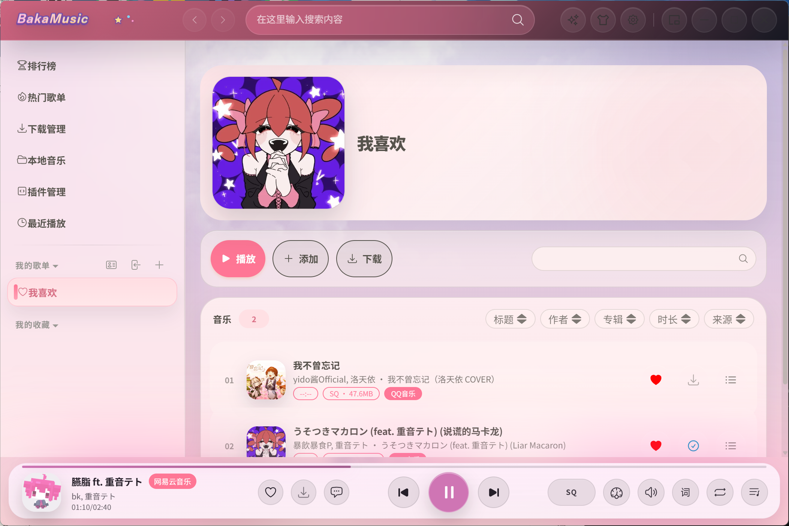
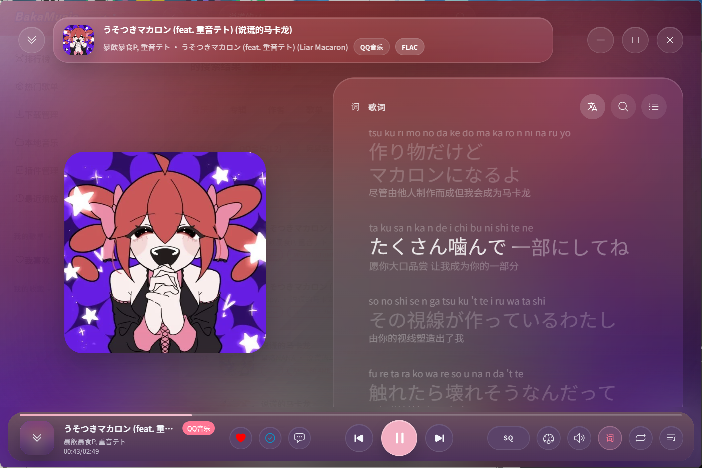
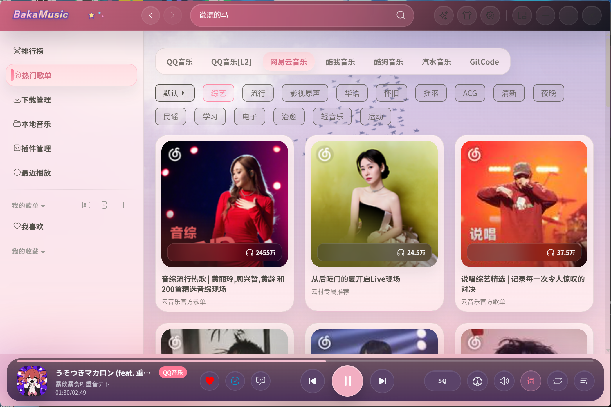
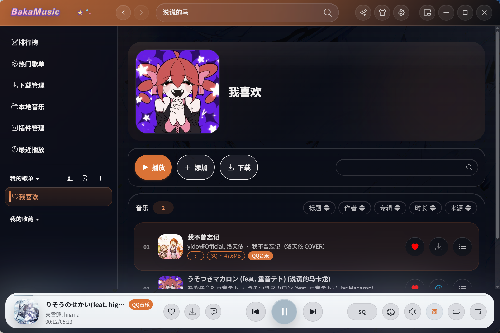

# BakaMusic


---

一个插件化、定制化、无广告的免费桌面音乐播放器。

BakaMusic 基于 [MusicFreeDesktop](https://github.com/maotoumao/MusicFreeDesktop) 重构而来，采用 Electron + React + TypeScript 技术栈，支持 Windows、macOS 和 Linux 平台。应用本身不集成任何音源——所有搜索、播放、歌单导入等功能均通过插件实现。

## 特性

- **插件化音源** — 本身不内置任何平台音源，通过插件扩展搜索、播放、歌词、专辑、歌单导入等能力。只要有对应插件，互联网上的任意音源都可接入。
- **逐字歌词** — 支持 word-level 逐字歌词显示与罗马音注音。
- **桌面歌词** — 独立歌词悬浮窗，支持自定义字体与样式。
- **迷你模式** — 紧凑型播放器窗口，不占桌面空间。
- **主题包系统** — 通过 CSS 变量 + iframe 背景实现高度自定义外观。
- **多音质支持** — 128k / 192k / 320k / FLAC / Hi-Res / Dolby Atmos 等。
- **下载管理** — 并发下载队列，支持音质选择与进度追踪。
- **本地音乐** — 扫描本地目录，自动识别元信息与编码，支持列表/作者/专辑/文件夹视图。
- **多语言** — 简体中文、繁体中文、英文。
- **隐私优先** — 所有数据存储在本地，不上传个人信息。
- **免费开源** — 基于 GPL 协议开源。

## 截图







## 下载

前往 [GitHub Releases](https://github.com/Zencok/BakaMusic/releases) 下载对应平台安装包：

| 平台 | 格式 |
|------|------|
| Windows x64 | Setup 安装包 / Portable 免安装 |
| Windows x64 Legacy | 兼容旧系统 (Electron 22) |
| macOS x64 | DMG |
| macOS arm64 (Apple Silicon) | DMG |
| Linux amd64 | DEB |

## 快速开始

```bash
# 安装依赖
npm install

# 启动开发模式
npm start

# 带 Electron Inspector 启动
npm run dev

# 代码检查
npm run lint

# 打包（不含安装器）
npm run package

# 构建平台安装包
npm run make
```

### 构建 Windows 安装包

需要安装 [Inno Setup](https://jrsoftware.org/isinfo.php) 并将 `iscc` 加入 PATH：

```bash
npm run package
MSYS_NO_PATHCONV=1 iscc /DMyAppVersion=1.0.0 /DMyAppId=BakaMusic "release/build-windows.iss"
```

## 架构

```
src/
├── main/                 # Electron 主进程（窗口管理、托盘、深度链接）
├── renderer/             # 主窗口（React）
│   ├── components/       # 可复用 UI 组件
│   ├── pages/            # 页面视图
│   ├── core/             # 核心业务（播放器、下载器、歌单、本地音乐）
│   └── utils/            # 工具函数
├── renderer-lrc/         # 桌面歌词窗口
├── renderer-minimode/    # 迷你模式窗口
├── preload/              # Electron preload 脚本
├── shared/               # 跨进程共享模块（配置、插件、消息总线、快捷键、主题、i18n）
├── common/               # 公共工具与常量
├── types/                # TypeScript 类型定义
├── hooks/                # React Hooks
└── webworkers/           # Web Workers（下载、本地文件监听、数据库）
native/qmc2/             # QMC2 解密 native 模块 (C++ / node-gyp)
```

## 插件

插件协议与 [MusicFree 安卓版](https://github.com/maotoumao/MusicFree) 完全兼容。

插件可实现的能力：搜索（音乐/专辑/作者/歌单）、播放、获取歌词、查看专辑与作者详情、导入单曲与歌单等。

开发文档：[插件开发指南](https://musicfree.catcat.work/plugin/introduction.html)

## 主题包

主题包是一个包含 `index.css` 和 `config.json` 的文件夹。

`index.css` 通过覆盖 CSS 变量自定义外观：

```css
:root {
  --primaryColor: #f17d34;
  --backgroundColor: #fdfdfd;
  --textColor: #333333;
  --dividerColor: rgba(0, 0, 0, 0.1);
  --listHoverColor: rgba(0, 0, 0, 0.05);
  --listActiveColor: rgba(0, 0, 0, 0.1);
  --maskColor: rgba(51, 51, 51, 0.2);
  --shadowColor: rgba(0, 0, 0, 0.2);
  --successColor: #08A34C;
  --dangerColor: #FC5F5F;
  --infoColor: #0A95C8;
}
```

`config.json` 定义主题元信息，支持通过 `iframes` 字段将 HTML 页面作为软件背景。

主题包示例：

| 主题 | 预览 |
|------|------|
| 暗黑模式 |  |

## 技术栈

| 技术 | 用途 |
|------|------|
| Electron 40 | 桌面框架 |
| React 18 | UI 框架 |
| TypeScript 5 | 类型系统 |
| Webpack (Electron Forge) | 构建打包 |
| SCSS | 样式 |
| i18next | 国际化 |
| better-sqlite3 | 本地数据库 |
| sharp | 图像处理 |
| hls.js | HLS 流媒体播放 |

## 协议

本项目基于 [GPL](LICENSE) 协议开源。

> 原始桌面项目致谢：[MusicFreeDesktop](https://github.com/maotoumao/MusicFreeDesktop) by [maotoumao](https://github.com/maotoumao)
