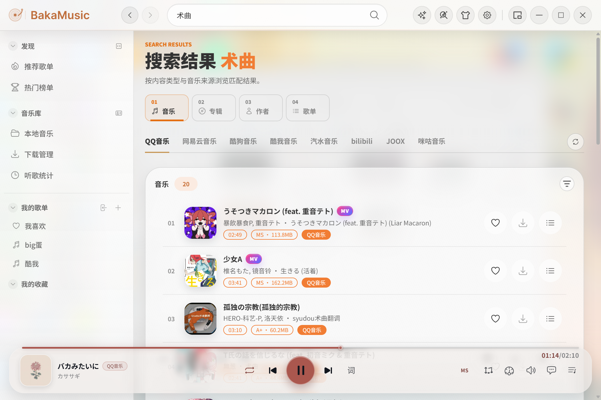
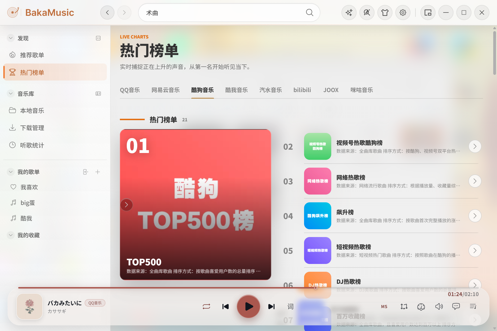
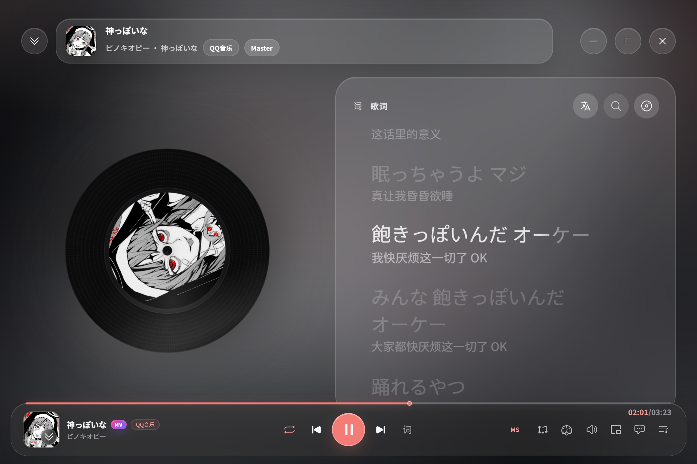
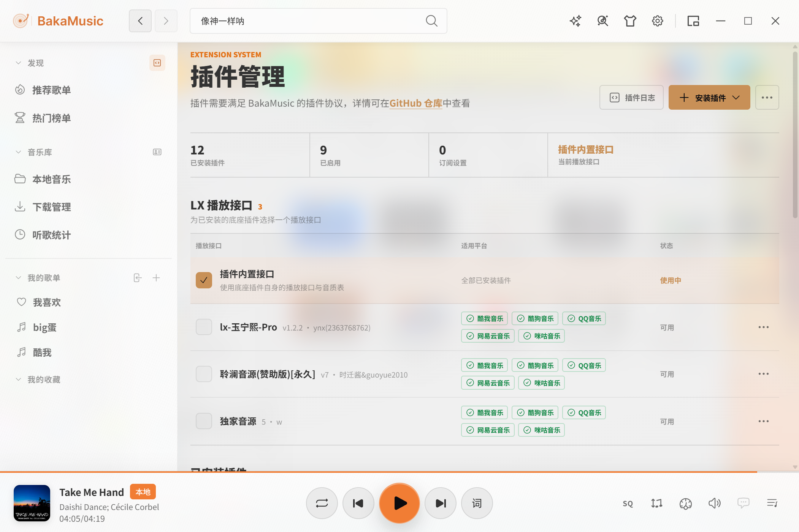
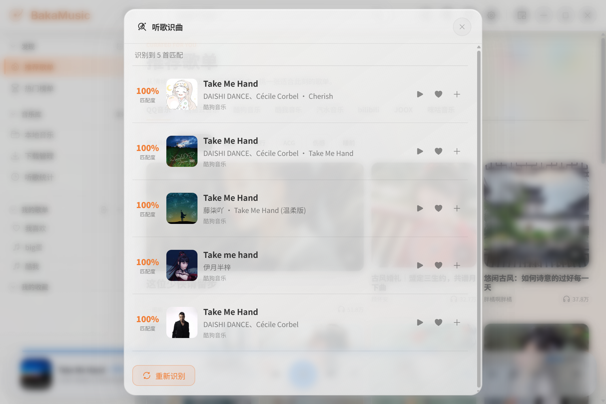
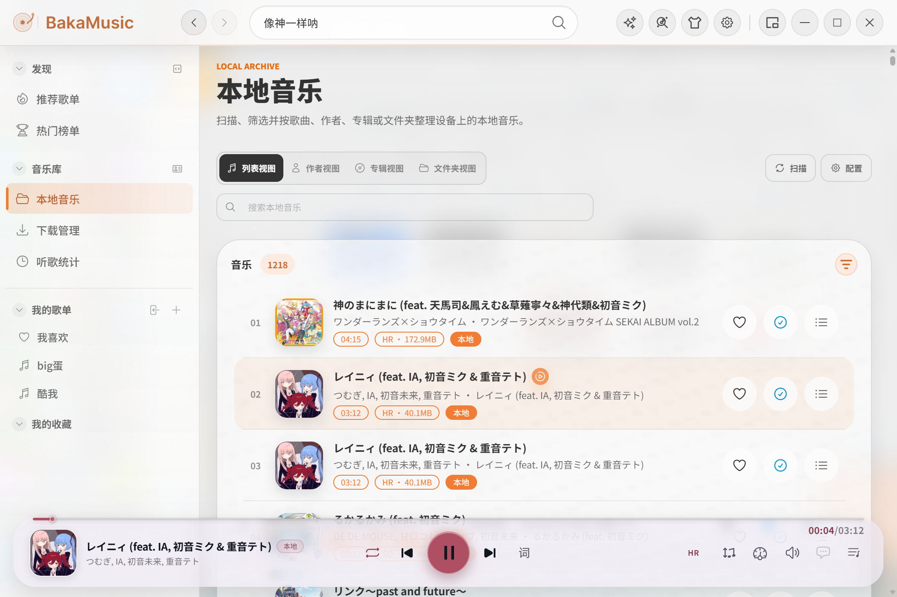
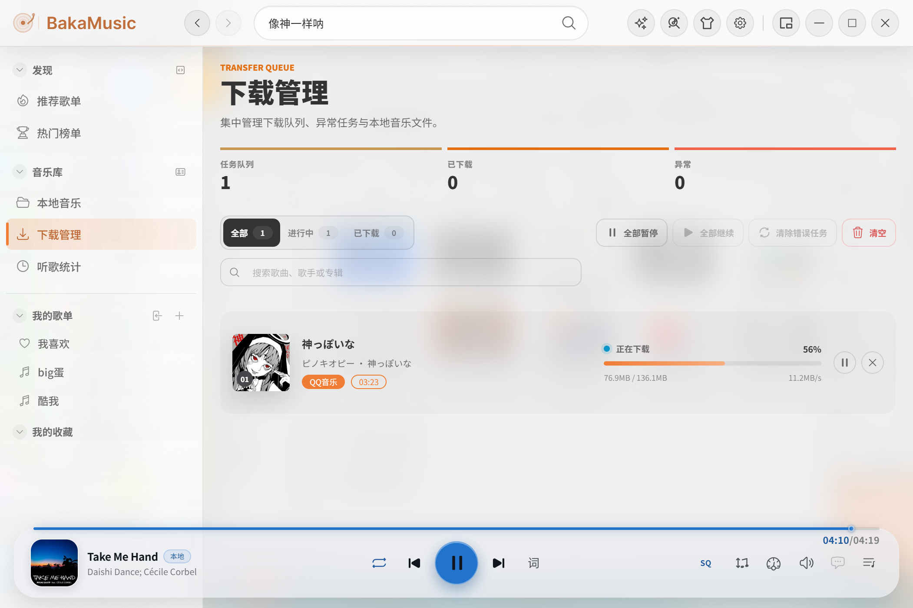
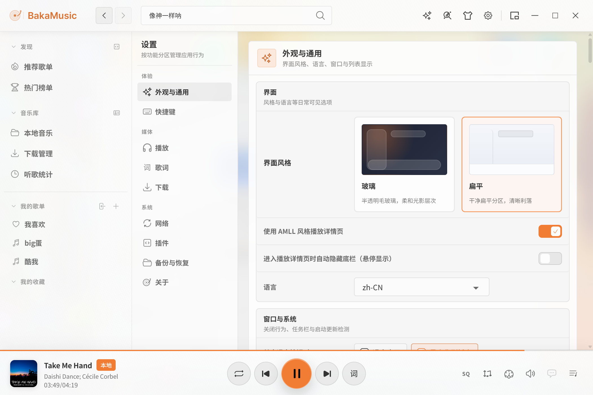
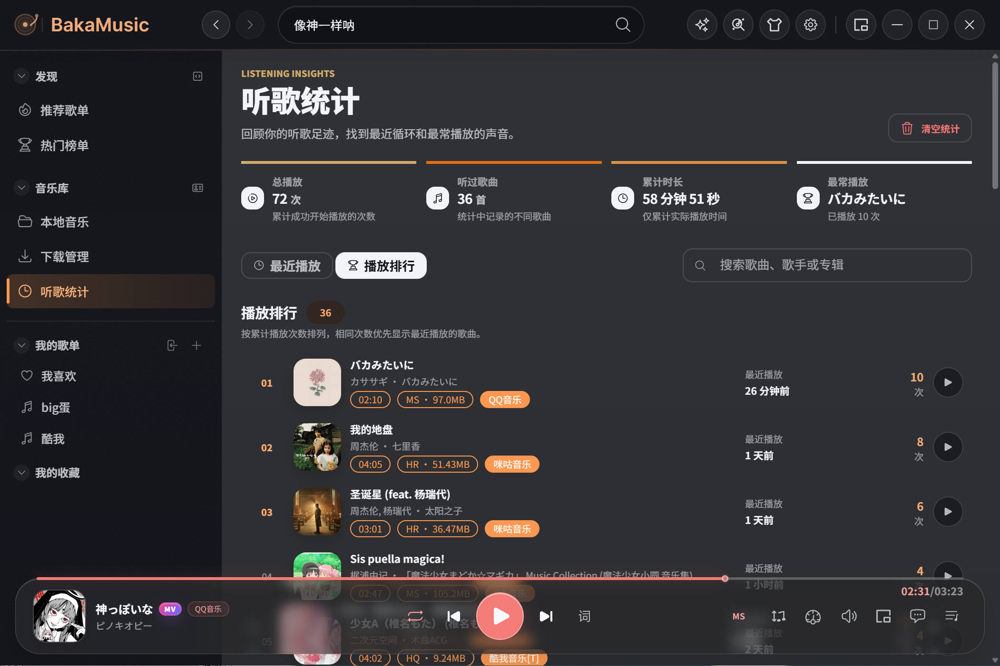
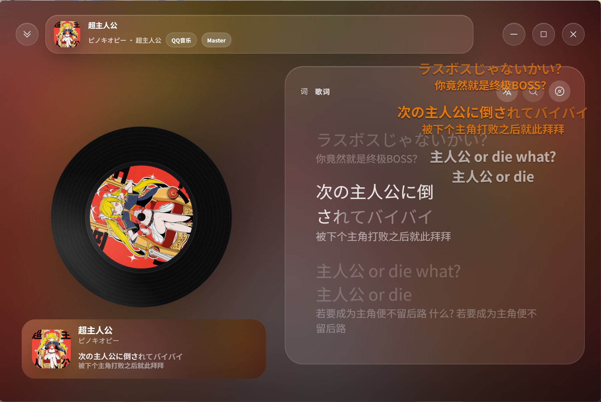

# BakaMusic

[](https://github.com/Zencok/BakaMusic/stargazers)
[](https://github.com/Zencok/BakaMusic/releases/latest)
[](https://github.com/Zencok/BakaMusic/releases)
[](https://github.com/Zencok/BakaMusic/issues)
[](LICENSE)

**无广告、无内置在线音源、由插件扩展。**

BakaMusic 是基于 Electron、React 和 TypeScript 的跨平台桌面音乐播放器。应用覆盖在线音乐、本地媒体、MV、逐字歌词、下载与主题定制，并通过插件连接用户选择的内容服务。

## 功能亮点

- **两套播放详情页**：可在经典沉浸式唱片界面与 AMLL 风格双栏界面间切换，支持动态背景、逐字歌词、全屏和完整播放控制。
- **统一原生播放核心**：音频与 MV 均由 `libmpv + LibreMPEG` 播放，广泛兼容本地音乐与视频格式，并支持远程 HTTP、HLS、自定义请求头和多档画质。
- **杜比与高动态范围**：支持 Dolby Atmos 等空间音频档位、AC-4/AC-3 等环绕声媒体，以及 Dolby Vision、HDR10 MV 的识别与原生渲染链路。
- **全平台 MV**：Windows、macOS 和 Linux 均支持 MV 播放、清晰度切换、倍速、全屏及下载；音频与视频状态可同步到 Windows SMTC、macOS MediaPlayer 和 Linux MPRIS2。
- **双插件生态**：支持功能完整的 BakaMusic 插件，并可导入 LX 音源脚本作为播放接口；插件可扩展搜索、歌单、榜单、歌词、音质、MV、分享和听歌识曲。
- **完整歌词体验**：支持 TTML、LRC、YRC、QRC、ESLRC 等格式，以及逐字、翻译、罗马音、Ruby 注音、背景人声、对唱、桌面歌词和迷你模式。
- **本地库与下载**：提供本地媒体扫描、专辑/艺术家/文件夹浏览、断点续传、批量任务、标签与封面写入、歌词保存和可选下载后转码。
- **个性化与数据管理**：提供玻璃/扁平界面、自动跟随系统的浅色/深色默认主题、V2 主题包、歌单与听歌统计、WebDAV 备份，以及简体中文、繁体中文和 English。

> Dolby Vision、HDR10、Dolby Atmos 等能力取决于媒体源、操作系统、显示/音频设备及其驱动支持。

## 界面

| 主页 | 排行榜 |
|---|---|
|  |  |

| 经典播放详情 | AMLL 播放详情 |
|---|---|
|  |  |

| 插件管理与 LX 播放接口 | 听歌识曲 |
|---|---|
|  |  |

| 本地音乐 | 下载管理 |
|---|---|
|  |  |

| 推荐歌单 | 主题市场 |
|---|---|
|  |  |

| 设置 | 深色界面 |
|---|---|
|  |  |

<p align="center">
  
</p>

## 下载

从 [GitHub Releases](https://github.com/Zencok/BakaMusic/releases) 下载正式版本。

| 平台 | 发布包 |
|---|---|
| Windows x64 | NSIS 离线安装包 / NSIS Web / Portable ZIP |
| macOS x64、arm64 | DMG |
| Linux amd64、arm64 | DEB / AppImage |

完整发布包已包含对应平台的 libmpv 媒体运行时，无需单独安装播放组件。

## 插件与主题

BakaMusic 不附带在线音源。插件在独立受控进程中运行，网络、存储和媒体能力由应用边界统一管理。

- 插件开发：[`docs/plugin-development.md`](docs/plugin-development.md)
- 插件类型契约：[`src/types/plugin.d.ts`](src/types/plugin.d.ts)
- 主题包仓库：[BakaThemePacks](https://github.com/Toskysun/BakaThemePacks)
- V2 主题契约：[`src/shared/themepack/contract.ts`](src/shared/themepack/contract.ts)

V2 主题包使用 `bakamusic-theme@2` 规范，由 `config.json`、`index.css` 及可选的 `imgs/`、`iframes/` 资源组成。主题负责视觉，布局和交互由客户端保持一致。

未安装自定义主题时，内置默认主题会在浅色和深色两套配色间自动跟随系统设置切换，目前不支持手动选择默认主题的明暗模式。

## 本地开发

要求 Node.js `24.15.0`（见 `.node-version`）及 npm。

```bash
npm install
npm start
```

提交前运行：

```bash
npm exec tsc -- --noEmit --pretty false
npm exec eslint -- ./src
npm test
```

涉及窗口、preload、IPC、服务、native 或打包的变更还需运行：

```bash
npm run package
npm run smoke:package
```

更多脚本与仓库边界见 [`AGENTS.md`](AGENTS.md)，版本变化见 [`changelog.md`](changelog.md)。

## 架构

```text
src/main/               Electron 主进程与系统能力
src/preload/            contextBridge 安全边界
src/renderer/           主窗口 React 应用
src/renderer-lrc/       桌面歌词窗口
src/renderer-minimode/  迷你模式窗口
src/shared/             跨进程契约与能力模块
src/webworkers/         utilityProcess 后台任务
src/amll-core/          AMLL 上游同步区
res/                    语言、服务与运行时资源
```

Renderer 默认关闭 Node integration，并通过最小化 preload 接口调用主进程；插件、下载、文件任务及媒体服务运行在隔离进程中。生产包启用 ASAR 完整性与 Electron fuses。

## 第三方与许可

- `src/amll-core/` 基于 [applemusic-like-lyrics](https://github.com/amll-dev/applemusic-like-lyrics)，并保留完整上游同步边界。
- BakaMusic 不提供在线音源或媒体内容。插件、数据来源及内容使用由其提供者与使用者负责，请遵守所在地区法律、服务条款与版权规则。
- 软件按现状提供，采用 [AGPL-3.0-only](LICENSE) 许可。
